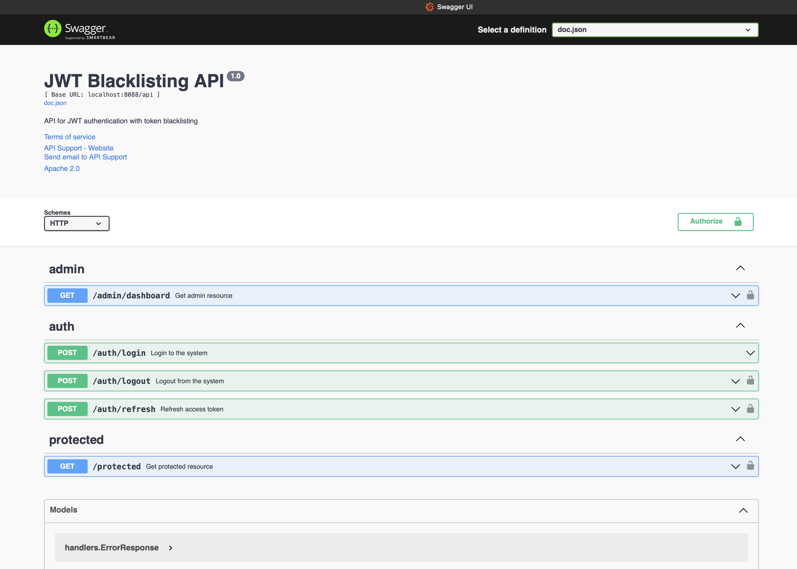

# API Documentation with Swagger

The JWT blacklist application includes comprehensive API documentation using Swagger (OpenAPI). This allows developers to explore and test the API endpoints through an interactive web interface.

## Accessing Swagger Documentation

Once the application is running, you can access the Swagger UI at:

```
http://localhost:8080/swagger/index.html
```



## Available Endpoints

### Authentication Endpoints

| Method | Endpoint | Description | Authentication |
|--------|----------|-------------|----------------|
| POST | `/api/auth/login` | Authenticate and get JWT tokens | None |
| POST | `/api/auth/refresh` | Refresh access token | Refresh token required |
| POST | `/api/auth/logout` | Logout (blacklist current token) | Access token required |

### Protected Resources

| Method | Endpoint | Description | Authentication |
|--------|----------|-------------|----------------|
| GET | `/api/protected` | Access protected resource | Access token required |
| GET | `/api/admin/dashboard` | Access admin-only resource | Admin role required |

## Authentication Flow

The JWT authentication flow is fully documented in Swagger, including:

1. **Login**: Get access and refresh tokens
2. **Protected Resource Access**: Use access token for authentication
3. **Token Refresh**: Get new access token using refresh token
4. **Logout**: Blacklist current token

## Testing API via Swagger

### Step 1: Login

1. Expand the `/api/auth/login` endpoint
2. Click "Try it out"
3. Enter credentials:
   ```json
   {
     "username": "admin",
     "password": "admin123"
   }
   ```
4. Click "Execute"
5. Copy the `access_token` from the response

### Step 2: Authorize

1. Click the "Authorize" button at the top of the page
2. Enter your token in the format: `Bearer your_token_here`
3. Click "Authorize" and close the dialog

### Step 3: Test Protected Endpoints

Now you can test any protected endpoint with your authorized session.

## Multi-Device Testing

You can simulate multi-device access by:

1. Opening Swagger in two different browser windows or browsers
2. Logging in with the same credentials in both
3. Using different tokens for each browser
4. Logging out in one browser
5. Confirming the other browser's token still works

This demonstrates the key feature of token blacklisting with multi-device support.

## Response Codes

| Code | Description |
|------|-------------|
| 200 | Success |
| 400 | Bad Request - Invalid input |
| 401 | Unauthorized - Authentication required or token expired/invalid |
| 403 | Forbidden - Insufficient permissions |
| 500 | Internal Server Error |

## Token Blacklisting Demonstration

Swagger provides an excellent way to demonstrate the token blacklisting functionality:

1. Login to get a token
2. Use the token to access a protected resource
3. Logout (which blacklists the token)
4. Try to use the same token again - you'll receive a 401 Unauthorized response

This demonstrates that the token has been successfully blacklisted.

## Development Integration

During development, you can use Swagger to:

1. Test API endpoints without writing client code
2. Verify authentication flows
3. Ensure proper error handling
4. Share API documentation with team members
